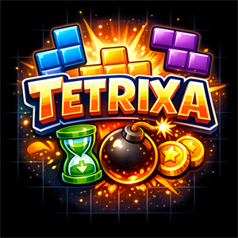
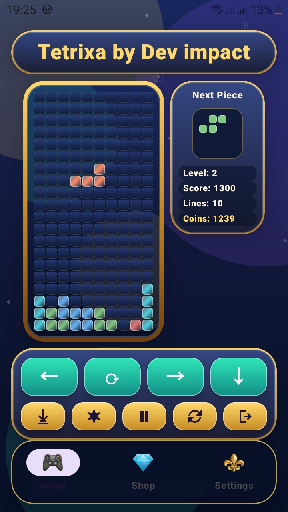
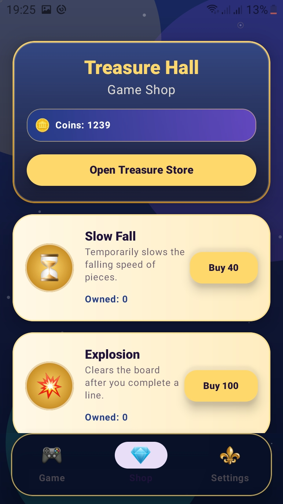
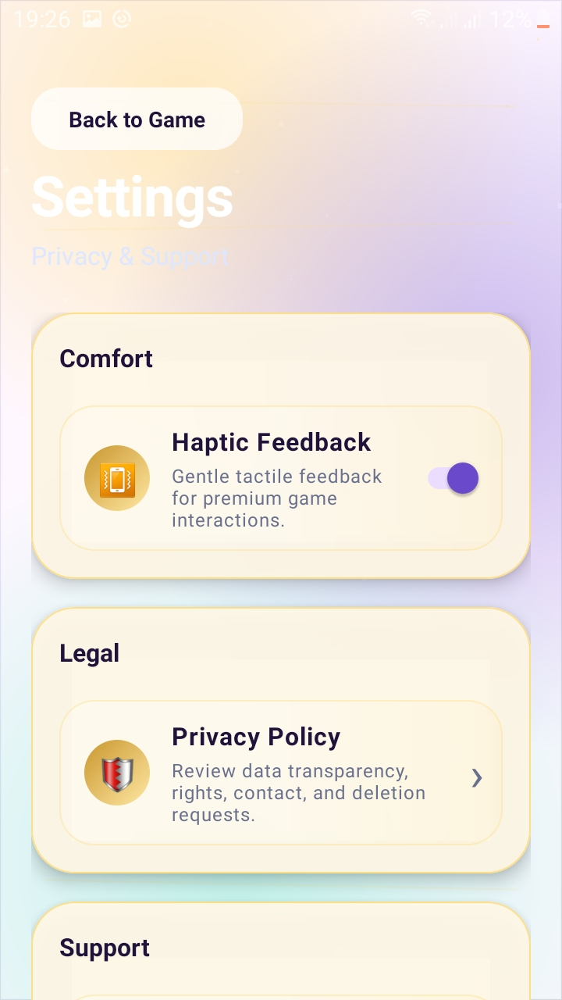
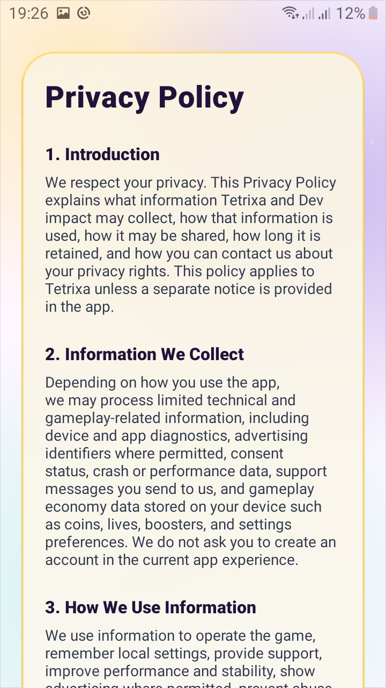
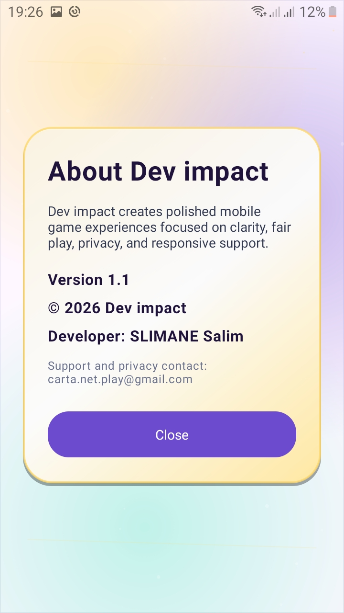
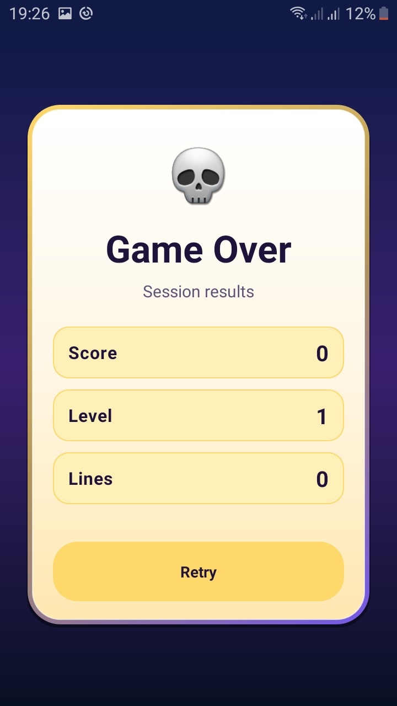

# 🧩 Tetrixa: Block Puzzle Arcade

  

  

  
  
  
  
  
  

---

# ⚡ About Tetrixa

**Tetrixa** is a fast-paced arcade block puzzle game built to test your reflexes, focus, and strategic thinking under pressure.

Arrange falling pieces quickly, clear rows intelligently, and survive increasingly challenging gameplay rounds in an addictive puzzle loop designed for both casual players and competitive score chasers.

Whether you enjoy quick mobile puzzle sessions or long high-score runs, Tetrixa delivers a modern block puzzle experience with smooth controls, fast reactions, and rewarding arcade progression.

---

# 📥 Download Tetrixa

  

---

# 🎮 Fast Arcade Block Puzzle Gameplay

Move, rotate, and position falling blocks precisely to:

* Clear horizontal lines
* Prevent the board from stacking up
* Increase your score
* Build momentum
* Survive longer rounds

Every second matters.

As the speed increases, every placement becomes a strategic choice between safety and risk, creating a rewarding puzzle experience that keeps players coming back for one more run.

---

# 🧠 Why Tetrixa Is Different

Tetrixa combines:

* ⚡ Fast arcade puzzle gameplay
* 🧩 Strategic block placement mechanics
* 🎯 High-focus reaction gameplay
* 📱 Smooth mobile controls
* ♾️ Endless replayability
* 📶 Complete offline gameplay support

The game is designed to be easy to start while offering enough depth for long-term mastery and score optimization.

---

# 💥 Core Gameplay Features

* 🧩 Rotate and move pieces with precision
* ⚡ Fast-paced arcade rhythm
* 🎯 Smart puzzle decision-making
* 📈 Gradually increasing difficulty
* 🏆 Score-focused progression system
* 📱 Lightweight and optimized gameplay
* 🎮 Short rounds for quick sessions
* 🧠 Long-term mastery and strategy depth
* 🔊 Responsive controls and smooth feedback

Every successful line clear increases the pace and intensifies the challenge.

---

# 📈 Progression & Motivation

Tetrixa rewards consistency, focus, and improvement.

As you play:

* Difficulty gradually increases
* Faster gameplay tests your reflexes
* Achievement chains reveal your progress
* Higher scores unlock stronger personal milestones
* Every run becomes a new challenge

The balanced progression system keeps gameplay exciting without becoming frustrating.

---

# 📱 Designed for Mobile Play

Tetrixa is optimized for:

* Fast loading
* Smooth performance
* Clear visual readability
* Instant touch response
* Comfortable long sessions
* Stable offline gameplay

The clean interface and responsive controls help players stay focused even during intense high-speed moments.

---

# ✨ Features

* 🧩 Classic falling block puzzle gameplay
* ⚡ Fast-paced arcade challenge
* 📶 Full offline game support
* 🎯 Smooth touch controls
* 🏆 High-score focused gameplay
* 📈 Increasing speed and difficulty
* 🧠 Strategic puzzle mechanics
* ♾️ Endless replay value
* 📱 Optimized Android performance
* 🎨 Clean visuals and polished effects
* 🔊 Sound and vibration customization
* 🚀 Lightweight mobile experience

---

# 📸 Screenshots

  
  
  
  
  
  

---

# 🎯 Perfect For Players Who Enjoy

* Block puzzle games
* Fast arcade gameplay
* Reflex-based mobile games
* Offline puzzle games
* High-score challenges
* Strategy puzzle mechanics
* Casual mobile gaming
* Endless gameplay progression

Whether you're a new player or a puzzle veteran, Tetrixa offers a satisfying challenge that becomes more rewarding as your skills improve.

---

# 🛠️ Built With

* Android Studio
* Java / Kotlin
* Android SDK
* XML UI
* Google Play Services
* AdMob

---

# ❤️ Support The Game

If you enjoy Tetrixa, you can support the project by:

* ⭐ Rating the game on Google Play
* 📢 Sharing the game with friends
* 💡 Suggesting new gameplay ideas
* 🐞 Reporting bugs and issues

Your support helps improve future updates and features.

---

# 🔗 Google Play

  

---

# 👨‍💻 Developer

Developed with passion by **DevImpact**.

> “Think faster. Place smarter. Survive longer.”

---

# 📄 License

Copyright © 2026 DevImpact. All Rights Reserved.

This project and its assets may not be copied, modified, distributed, or reused without explicit permission from the developer.
